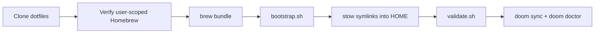
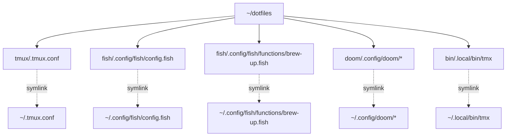

# Dotfiles: tmux + Doom Emacs + fish (Homebrew-first)

This repo centralizes your terminal/editor stack so changes are easy to sync and reproducible on a new machine.

Current setup policy: `scripts/setup.sh` is current-user-only.
It only writes inside `$HOME`, refuses shared Homebrew prefixes, and does not modify system files such as `/etc/shells`.

## What is managed

- `tmux`: `~/.tmux.conf`, `~/.tmux/*`
- `fish`: `~/.config/fish/**`
- `doom`: `~/.config/doom/*`
- `bin`: `~/.local/bin/tmx`
- `scripts`: bootstrap/install/validate helpers

## Repository layout

```text
~/dotfiles
├── brewfile
├── README.md
├── bin/
│   └── .local/bin/tmx
├── doom/
│   └── .config/doom/{init.el,config.el,packages.el,KEYS.md}
├── fish/
│   ├── .config/fish/config.fish
│   └── .config/fish/functions/brew-up.fish
├── tmux/
│   ├── .tmux.conf
│   └── .tmux/{cheatsheet.txt,show-help.sh}
└── scripts/
    ├── setup.sh
    ├── bootstrap.sh
    ├── drift-check.sh
    ├── install-brew.sh
    ├── install-tools.sh
    ├── set-default-shell.sh
    └── validate.sh
```

## Why Stow

GNU Stow creates symlinks from this repo into `$HOME`, so you edit one source of truth (`~/dotfiles`) and the live config updates immediately.

Pros:
- Single source of truth across machines
- Easy Git sync/versioning
- Low lock-in; plain files + symlinks

Cons:
- Symlink model can confuse some tools
- Initial conflicts if files already exist in `$HOME` (handled by `bootstrap.sh` backups)

## End-to-end flow



## Symlink model



## First-time setup (new machine)

Recommended one-click setup:

```bash
git clone <your-repo-url> ~/dotfiles
cd ~/dotfiles
./scripts/setup.sh
```

Setup flags:

```bash
./scripts/setup.sh -h
./scripts/setup.sh --yes
./scripts/setup.sh --yes --skip-doom --skip-validate
```

Manual path (step-by-step):

1. Clone repo:

```bash
git clone <your-repo-url> ~/dotfiles
cd ~/dotfiles
```

2. Verify a user-scoped Homebrew install under `$HOME`:

```bash
./scripts/install-brew.sh
```

3. Install all tools:

```bash
./scripts/install-tools.sh
```

4. Link dotfiles into `$HOME` (backs up non-symlink conflicts):

```bash
./scripts/bootstrap.sh
```

5. Optionally set fish as default shell after an admin has already approved it in `/etc/shells`:

```bash
./scripts/set-default-shell.sh
```

6. Initialize Doom (first machine only):

```bash
~/.config/emacs/bin/doom install
~/.config/emacs/bin/doom sync
~/.config/emacs/bin/doom doctor
```

7. Validate install:

```bash
./scripts/validate.sh
```

## Daily workflow

- Edit configs inside `~/dotfiles/...`
- Reload apps:
  - tmux: `tmux source-file ~/.tmux.conf`
  - fish: `exec fish`
  - Doom: `~/.config/emacs/bin/doom sync`
- Commit changes:

```bash
cd ~/dotfiles
git add -A
git commit -m "Update tmux/fish/doom"
git push
```

## Homebrew QoL (fish)

- `brew-up`: comprehensive Homebrew maintenance with dotfiles sync

It lives in `fish/.config/fish/functions/brew-up.fish` so Stow can link it into `~/.config/fish/functions/`.

It runs:

```bash
brew update
brew outdated
brew upgrade
brew bundle install --file ~/dotfiles/brewfile --upgrade
brew autoremove
brew cleanup --prune=all
```

## Navigation QoL (fish)

- `tree [path]`: compact tree (depth 2), hides dotfiles, respects `.gitignore`
- `tree-all [path]`: same as `tree` but includes dotfiles
- `tree-depth <depth> [path]`: tree with custom depth
- `jump <query>`: jump to frequently used directory (zoxide-ranked)
- `jump-interactive`: interactive fuzzy jump picker
- `ta`/`td` remain as backward-compatible aliases

Examples:

```bash
tree
tree ~/dotfiles
tree-all ~/dotfiles
tree-depth 4 ~/Spaces
jump dot
jump-interactive
```

## Drift and health checks

- Symlink drift check:

```bash
./scripts/drift-check.sh
```

- Full tool + Doom health check:

```bash
./scripts/validate.sh
```

## Devcontainer, Bun, and Git parity notes

- `setup.sh` configures GPG signing for terminal workflows by setting `gpg-agent` `pinentry-program` (uses Homebrew `pinentry-mac` on macOS).
- `setup.sh` explicitly ensures `devcontainer` CLI: Homebrew first, bun fallback (`@devcontainers/cli`).
- `devcontainer` CLI is still declared in `brewfile` for normal Homebrew-managed installs.
- `bun` is installed via Homebrew (`brewfile`) for JS/TS runtime + package manager parity.
- Keep Docker Desktop running before `devcontainer up`.
- Git stays standard CLI-first; use Magit in Emacs for visual commit/branch workflows.

## Migration from an existing machine

`bootstrap.sh` creates timestamped backups at:

- `~/.dotfiles-backup/YYYYmmdd-HHMMSS/...`

Only non-symlink existing files are moved there before stow linking.

## Optional enhancements

- Add machine-specific overrides with local files sourced conditionally (not committed).
- Add CI (e.g., GitHub Actions) to run shellcheck + `stow --simulate` on each push.
